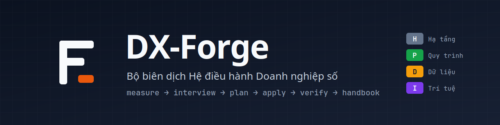
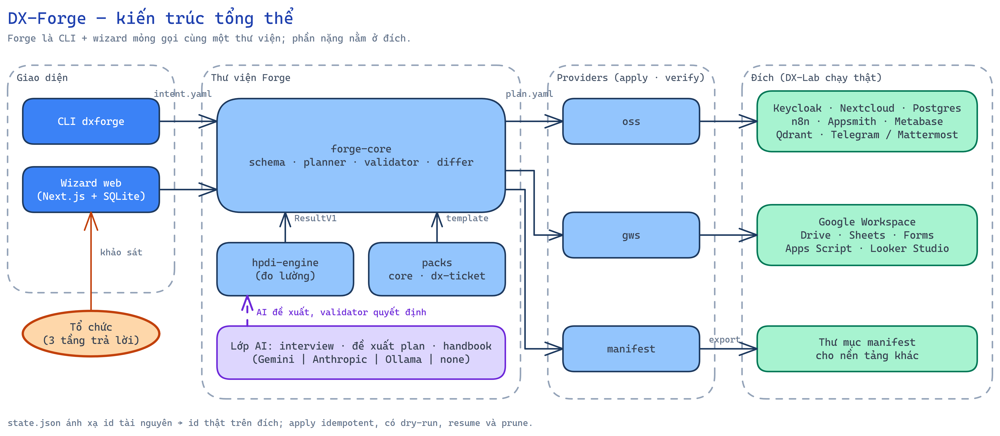

<p align="center">
  
</p>

<h1 align="center">DX-Forge</h1>

<p align="center">
  <em>Bộ biên dịch Hệ điều hành Doanh nghiệp số (DX-OS): đo tổ chức, phỏng vấn ra đặc tả, sinh kế hoạch bốn lớp, cấp phát lên hệ thống thật, kiểm chứng, viết sổ tay.</em>
</p>

<p align="center">
  <a href="https://github.com/maiychrus25/DX-Forge/actions/workflows/ci.yml"></a>
  <a href="LICENSE"></a>
  
  
  
</p>

<p align="center">
  <a href="https://github.com/maiychrus25/DX-Forge/stargazers"></a>
  <a href="https://github.com/maiychrus25/DX-Forge/issues"></a>
  <a href="https://github.com/maiychrus25/DX-Forge/commits/develop"></a>
  <a href="https://github.com/maiychrus25/DX-Forge/releases"></a>
</p>

---

<p align="center">
  
</p>

## 🌟 Tầm nhìn

Hầu hết "nền tảng chuyển đổi số" là thứ bạn **cài**. DX-Forge là thứ **sinh ra cái bạn cài**.

Forge lấy phương pháp luận của cuốn sách mở *Xây dựng Hệ điều hành Doanh nghiệp số: Từ Tư duy đến Hành động* (Tạ Tuấn Anh, CC BY 4.0) và biến nó thành một đường ống có thể chạy:

- **Đo trước khi xây.** Khảo sát ba tầng, sáu trụ cột, ba câu thực chứng. Kết quả ánh xạ ra mô hình HPDI và một trong bốn hình dạng radar.
- **Đúng trật tự, không nhảy cóc.** Cổng trưởng thành khoá lớp chưa đủ điều kiện. Tổ chức chưa có quy trình không được bật AI.
- **Mọi tài nguyên có lý do.** Kế hoạch sinh ra giải thích được từng thư mục, vai trò, biểu mẫu, workflow.
- **Đầu ra chạy không cần Forge.** Thứ Forge sinh ra là một DX-Lab thật trên phần mềm nguồn mở thật.

> [!NOTE]
> **Forge không phải nền tảng vận hành.** Forge không có runtime, không có marketplace, không có tác tử thường trực.
> Forge là một CLI và một wizard mỏng; phần nặng nằm ở hệ thống đích.

## ⚙️ Đường ống

<p align="center">
  
</p>

```
measure ──► interview ──► plan ──► apply ──► verify ──► handbook ──► (đo lại)
ResultV1    intent.yaml   plan.yaml  state.json  report     Resources/00. Portal
```

| Giai đoạn | Việc xảy ra | Đầu ra |
|---|---|---|
| **measure** | Khảo sát ẩn danh ba tầng (lãnh đạo, quản lý, nhân viên). Tính điểm sáu trụ cột, độ vênh giữa tầng, hệ số thực chứng. Ánh xạ HPDI, phân loại hình dạng, mức trưởng thành. | `ResultV1` |
| **interview** | Trợ lý AI (hoặc form thường) chuyển kết quả đo và một cuộc trò chuyện ngắn thành đặc tả nhỏ, người đọc được. | `intent.yaml` (≤ 80 dòng) |
| **plan** | Engine mở rộng gói ngành và luật thành kế hoạch bốn lớp **H · P · D · I**. Mỗi tài nguyên có lý do, phụ thuộc, cổng. Validator không tắt được. | `plan.yaml` |
| **apply** | Provider tạo tài nguyên trên đích. Idempotent, có dry-run, chạy tiếp sau ngắt, prune. | `state.json` |
| **verify** | Kiểm từng tài nguyên trên hệ thống thật: đăng nhập được, kho tài nguyên chỉ đọc, form chặn dữ liệu sai, workflow bắn thông báo. | báo cáo |
| **handbook** | Sổ tay nghiệp vụ số viết từ kế hoạch, đẩy vào cổng thông tin của đích. | markdown |

## 🏗️ Kiến trúc

<p align="center">
  
</p>

```
packages/hpdi-engine/   bộ câu hỏi v1, tính điểm, ánh xạ HPDI, hình dạng, kê đơn  (TypeScript thuần)
packages/forge-core/    schema zod (intent, plan, state), loader gói, planner, validator, differ
packs/                  gói ngành: core (thu hồi truy cập), dx-ticket (yêu cầu khách hàng)
apps/cli/               dxforge plan | packs list | explain
examples/               intent.example.yaml
docs/                   BRD, SRS, bộ tài liệu BA (18 sơ đồ Excalidraw), spec, plan, brand
```

Engine không phụ thuộc web hay cơ sở dữ liệu. forge-core không phụ thuộc provider nào. Provider, lớp AI và wizard là các gói riêng, thêm dần theo lộ trình.

## 🧭 Bốn lớp và cổng trưởng thành

| Lớp | Tên | Tài nguyên tiêu biểu |
|:---:|---|---|
| **H** | Hạ tầng | realm, vai trò, nhóm phòng ban, cây thư mục P.A.R.A, ACL, cổng thông tin, kênh chat |
| **P** | Quy trình | thực thể, biểu mẫu có rào chắn, máy trạng thái, luật, workflow, màn hình làm việc |
| **D** | Dữ liệu | bảng điều khiển có che PII, chụp dữ liệu định kỳ, ngữ cảnh JSON-LD |
| **I** | Trí tuệ | nguồn RAG, chính sách tác tử có người duyệt, trợ lý theo khung 5 RÕ |

Cổng trưởng thành đọc hình dạng radar đã đo và quyết định lớp nào được mở:

| Hình dạng | Nghĩa | Lớp được mở |
|---|---|---|
| 🗡️ **spear** (mũi giáo) | H ≥ 75: chỉ có hạ tầng | H |
| 🪁 **kite** / **transitional** | có quy trình, dữ liệu còn mỏng | H + P, thêm D khi P ≥ 20 |
| 🪞 **illusion** (ảo giác công nghệ) | dashboard và AI đi trước quy trình | H + P + D, **cấm I** với lý do *GIGO* |
| 💎 **diamond** (kim cương) | H ≤ 25, P·D·I cân bằng ≥ 20 | tất cả |

Tài nguyên bị khoá vẫn nằm trong kế hoạch, kèm lý do, để người duyệt thấy đích đến.

## 🛡️ Rào chắn là mã

Validator chạy sau mọi bước, kể cả sau AI. Không có cờ nào tắt được nó.

| Luật | Kiểm |
|---|---|
| `one_a` | mỗi chuyển trạng thái có đúng một vai trò chịu trách nhiệm (A) |
| `max_required` | tối đa 5 trường bắt buộc trên một biểu mẫu |
| `resources_read_only` | kho `3. [R] RESOURCES` chỉ đọc với toàn bộ nhân sự |
| `pii_masking` | dashboard trên thực thể có PII phải che đủ mọi trường PII |
| `hitl` | chính sách tác tử phải có kênh duyệt tồn tại và hạn duyệt ≤ 24 giờ |
| `dependencies` | id phụ thuộc tồn tại, không có vòng |
| `spec_schema` | spec của từng loại tài nguyên đúng schema |

## 🚀 Bắt đầu nhanh

Yêu cầu: Node 22+ và npm 10+. Giai đoạn `plan` không cần gì khác.

```bash
git clone git@github.com:maiychrus25/DX-Forge.git && cd DX-Forge
npm ci
npm test
npm run dxforge -- plan -f examples/intent.example.yaml -o plan.yaml
```

Intent mẫu mô tả một công ty bán lẻ nhỏ với một quy trình lõi (yêu cầu khách hàng, gói `dx-ticket`), đo được hình dạng *transitional* với P = 25.
Kế hoạch sinh ra có 33 tài nguyên; ba tài nguyên lớp I có mặt nhưng bị khoá:

```
[H] Hạ tầng (16)
  ✓ h.realm  identity.realm
  ✓ h.role.dx-admin  identity.role
  …
[P] Quy trình (8)
  ✓ cskh.form  process.form
  …
[I] Trí tuệ (3)
  ⛔ i.policy.cskh  intel.agent_policy  — transitional: lớp I mở khi hình dạng đạt diamond (H ≤ 25 và P, D, I ≥ 20), đúng trật tự P → D → I.

Đã ghi plan.yaml (33 tài nguyên).
```

Hỏi vì sao một tài nguyên tồn tại:

```bash
npm run dxforge -- explain cskh.form -p plan.yaml
```

```
cskh.form  [P] process.form
Lý do: Rào chắn lớp 1: chặn dữ liệu sai ngay khi nhập; tối đa 5 trường bắt buộc.
Phụ thuộc: cskh.entity
Gate: allowed=true
Nguồn: gói dx-ticket, quy trình cskh
```

## 🧰 Lệnh CLI

| Lệnh | Việc | Mã thoát |
|---|---|---|
| `dxforge plan -f intent.yaml [-o plan.yaml] [--packs-dir ./packs]` | sinh và kiểm kế hoạch | `0` đã ghi · `1` lỗi validator, không ghi · `2` đầu vào sai |
| `dxforge explain <id> -p plan.yaml` | lý do, phụ thuộc, cổng của một tài nguyên | `0` · `2` không có id |
| `dxforge packs list` | liệt kê gói ngành | `0` |
| `dxforge apply · verify · handbook · destroy` | các giai đoạn còn lại | theo lộ trình |

Chạy trong repo bằng `npm run dxforge -- <lệnh>`; bản đóng gói `npx dxforge` đến ở lộ trình 08.

## 📦 Gói ngành

Gói là một tệp `packs/<id>/pack.yaml` gồm các tài nguyên mẫu có biến `{{org.*}}` và `{{process.*}}`.

| Gói | Phạm vi | Sinh ra |
|---|---|---|
| `core` | mỗi tổ chức | bảng và workflow thu hồi truy cập năm bước |
| `dx-ticket` | mỗi quy trình | thực thể, biểu mẫu, máy trạng thái, luật, workflow SLA, màn hình làm việc |

Thêm gói mới là thêm một thư mục; engine không đổi.

## 🎯 Đích

| Đích | Tự động | Bán tự động |
|---|---|---|
| `oss` | Keycloak, Nextcloud (group folder + ACL), PostgreSQL (DDL + trigger), n8n, Appsmith, Metabase, Qdrant, Telegram / Mattermost | — |
| `gws` | Drive, Sheets (validation + protected range), Forms, Apps Script, Looker Studio | AppSheet: sinh cấu hình và hướng dẫn từng bước |
| `manifest` | xuất `manifest.yaml`, SQL, workflow, dashboard cho nền tảng tiêu thụ manifest | — |

Thông tin đăng nhập đích lấy từ biến môi trường nêu trong `target.credentials_ref`; không bao giờ ghi vào intent, plan hay state.

## 🗺️ Lộ trình

| # | Phạm vi | Trạng thái |
|:---:|---|:---:|
| 01 | monorepo, hpdi-engine, forge-core, gói, CLI `plan` | ✅ `v0.1.0-alpha.1` |
| 02 | wizard đo lường (Next.js, SQLite): link khảo sát, radar, kê đơn, bộ P.A.R.A | 🔜 |
| 03 | lớp AI (Gemini / Anthropic / Ollama / none): interview, đề xuất plan, handbook, explain | ⏳ |
| 04 | provider `oss` lớp H: Keycloak, Nextcloud, Telegram; apply, state, verify, destroy | ⏳ |
| 05 | provider `oss` lớp P/D/I: PostgreSQL, n8n, Appsmith, Metabase, Qdrant | ⏳ |
| 06 | wizard: cây kế hoạch, diff, tiến trình apply, báo cáo verify | ⏳ |
| 07 | provider `gws` | ⏳ |
| 08 | xuất manifest, đóng gói `npx dxforge`, v1.0.0 | ⏳ |

## 📚 Tài liệu

| Nhóm | Tài liệu |
|---|---|
| Yêu cầu | [BRD](docs/BRD.md) · [SRS](docs/SRS.md) |
| Phân tích nghiệp vụ | [Bộ BA 15 mục](docs/ba/00-README.md): BPMN, swimlane, trạng thái, use case, activity, màn hình, phân quyền, NFR |
| Thiết kế | [Spec tổng](docs/superpowers/specs/2026-09-09-dx-forge-design.md) · [Spec forge-core + provider oss](docs/superpowers/specs/2026-09-09-forge-core-oss-provider-design.md) · [Spec đo lường](docs/superpowers/specs/2026-09-09-m0-measurement-design.md) |
| Kế hoạch | [Plan 01](docs/superpowers/plans/2026-09-09-plan-01-core-engine-cli.md) |
| Thương hiệu | [Logo, bảng màu, quy tắc](docs/brand/README.md) |

<p align="center">
  
</p>

## 🏆 Hồ sơ nguồn mở

| Tệp | Nội dung |
|---|---|
| [LICENSE](LICENSE) | AGPL-3.0-or-later toàn văn; mọi tệp mã có dòng SPDX, CI kiểm |
| [LICENSE_NOTICE.md](LICENSE_NOTICE.md) | ghi công sách CC BY 4.0, ma trận đích tương thích |
| [DEPENDENCIES.md](DEPENDENCIES.md) | danh mục gói và giấy phép; không vendor, không sửa mã bên thứ ba |
| [BUILDING.md](BUILDING.md) | dựng từ mã nguồn, cấu hình chỉ qua biến môi trường |
| [CHANGELOG.md](CHANGELOG.md) | theo Keep a Changelog |
| [CONTRIBUTING.md](CONTRIBUTING.md) · [AGENTS.md](AGENTS.md) | quy tắc đóng góp cho người và cho tác tử lập trình |
| [.github/](.github/) | CI (typecheck, test, SPDX), mẫu issue, mẫu PR |

## 🐛 Báo lỗi và đóng góp

- Lỗi: mở [issue](https://github.com/maiychrus25/DX-Forge/issues/new?template=bug_report.md) với lệnh đã chạy, trích intent hoặc plan (bỏ thông tin bí mật), kết quả mong đợi và thực tế.
- Tính năng, gói ngành, adapter mới: mở [issue](https://github.com/maiychrus25/DX-Forge/issues/new?template=feature_request.md) nêu giai đoạn, lớp và lý do nghiệp vụ.
- Mã: nhánh từ `develop`, test trước, Conventional Commits, không trailer. Chi tiết trong [CONTRIBUTING.md](CONTRIBUTING.md).

## 📜 Giấy phép

- **Mã nguồn:** [AGPL-3.0-or-later](LICENSE)
- **Phương pháp luận:** *Xây dựng Hệ điều hành Doanh nghiệp số* của Tạ Tuấn Anh, [CC BY 4.0](https://opendigitransform.gitbook.io/dx-os). Chi tiết ghi công trong [LICENSE_NOTICE.md](LICENSE_NOTICE.md).
- **Hệ thống bên thứ ba** mà Forge cấp phát lên không được vendor hay sửa đổi. Xem [DEPENDENCIES.md](DEPENDENCIES.md).

---

## 🌐 English summary

DX-Forge is a compiler for the Digital Enterprise Operating System (DX-OS).
It measures an organisation with a three-tier survey, turns the result into a short `intent.yaml` through an AI-assisted interview, compiles a four-layer plan (Infrastructure, Process, Data, Intelligence) in which every resource carries a reason and a maturity gate, applies the plan to an open-source stack (Keycloak, Nextcloud, PostgreSQL, n8n, Appsmith, Metabase, Qdrant, Telegram) or to Google Workspace, verifies each resource on the live system, and writes the operating handbook.

Forge is not a platform. It has no runtime, no marketplace and no resident agents; what it produces is a real DX-Lab on real open-source software.
Code is AGPL-3.0-or-later; the methodology comes from the CC BY 4.0 book *Xây dựng Hệ điều hành Doanh nghiệp số* by Tạ Tuấn Anh.

```bash
npm ci && npm test
npm run dxforge -- plan -f examples/intent.example.yaml -o plan.yaml
npm run dxforge -- explain i.policy.cskh -p plan.yaml
```
