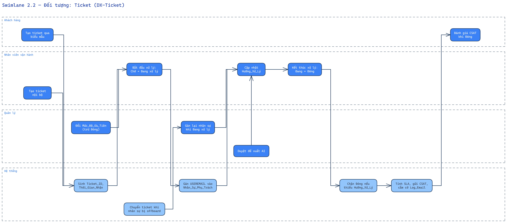
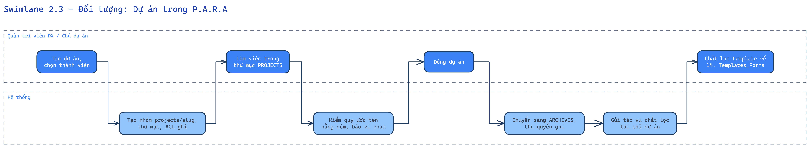
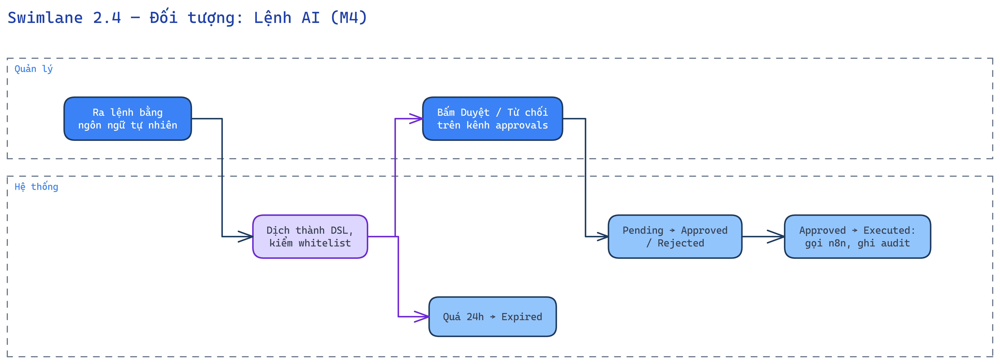

# 2. Swimlane workflow (theo đối tượng)

Mỗi sơ đồ mô tả các thao tác của từng nhóm người dùng trên MỘT đối tượng, và trạng thái nào cho phép thao tác nào.

## 2.1 Đối tượng: Đợt đo (Assessment)

*Nguồn chỉnh sửa: [`diagrams/swimlane-01-dot-do.excalidraw`](diagrams/swimlane-01-dot-do.excalidraw)*

Ràng buộc: chỉ chốt khi có ≥ 1 phản hồi executive và ≥ 1 staff; sau Closed không nhận thêm phản hồi (token hết hiệu lực).

## 2.2 Đối tượng: Ticket (DX-Ticket)

*Nguồn chỉnh sửa: [`diagrams/swimlane-02-ticket.excalidraw`](diagrams/swimlane-02-ticket.excalidraw)*

## 2.3 Đối tượng: Dự án trong P.A.R.A

*Nguồn chỉnh sửa: [`diagrams/swimlane-03-du-an-para.excalidraw`](diagrams/swimlane-03-du-an-para.excalidraw)*

## 2.4 Đối tượng: Lệnh AI (M4)

*Nguồn chỉnh sửa: [`diagrams/swimlane-04-lenh-ai.excalidraw`](diagrams/swimlane-04-lenh-ai.excalidraw)*
