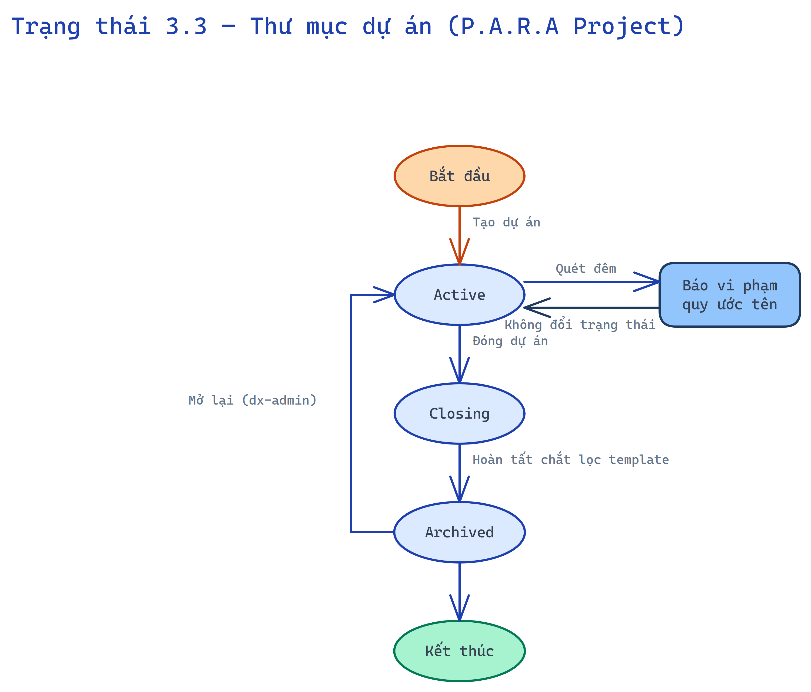
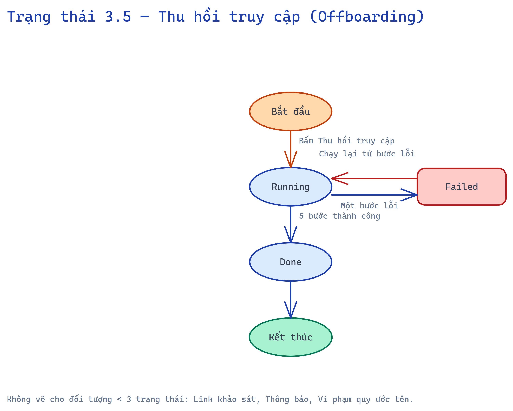

# 3. Biểu đồ trạng thái

Chỉ vẽ cho đối tượng có ≥ 3 trạng thái. Trục giữa là luồng cơ bản, nhánh bên là luồng thay thế/ngoại lệ.

## 3.1 Đợt đo (Assessment)

*Nguồn chỉnh sửa: [`diagrams/state-01-dot-do.excalidraw`](diagrams/state-01-dot-do.excalidraw)*

## 3.2 Ticket (DX-Ticket)

*Nguồn chỉnh sửa: [`diagrams/state-02-ticket.excalidraw`](diagrams/state-02-ticket.excalidraw)*

## 3.3 Thư mục dự án (P.A.R.A Project)

*Nguồn chỉnh sửa: [`diagrams/state-03-du-an.excalidraw`](diagrams/state-03-du-an.excalidraw)*

## 3.4 Lệnh AI (AiCommand, M4)

*Nguồn chỉnh sửa: [`diagrams/state-04-lenh-ai.excalidraw`](diagrams/state-04-lenh-ai.excalidraw)*

## 3.5 Thu hồi truy cập (Offboarding)

*Nguồn chỉnh sửa: [`diagrams/state-05-offboarding.excalidraw`](diagrams/state-05-offboarding.excalidraw)*

Đối tượng dưới 3 trạng thái, không vẽ: Link khảo sát (active/expired), Thông báo (sent/failed), Vi phạm quy ước tên (open/resolved).
