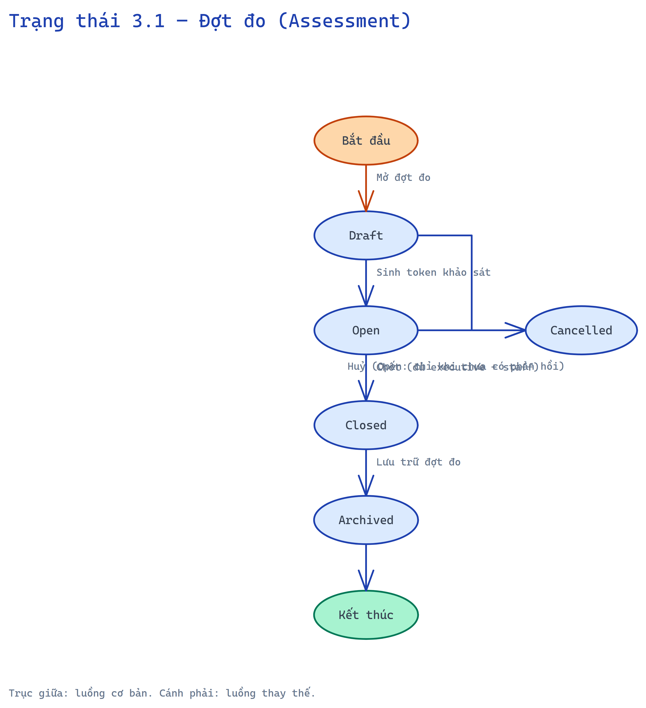
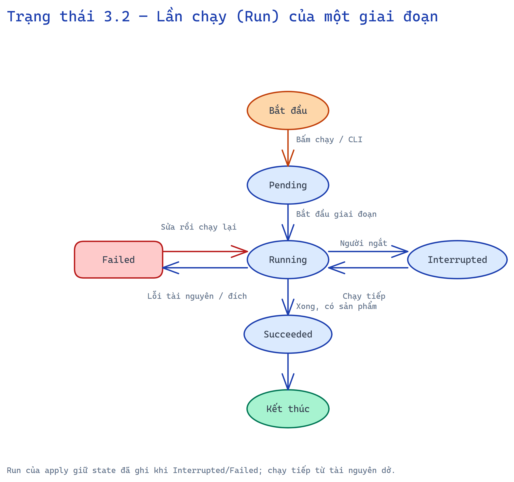
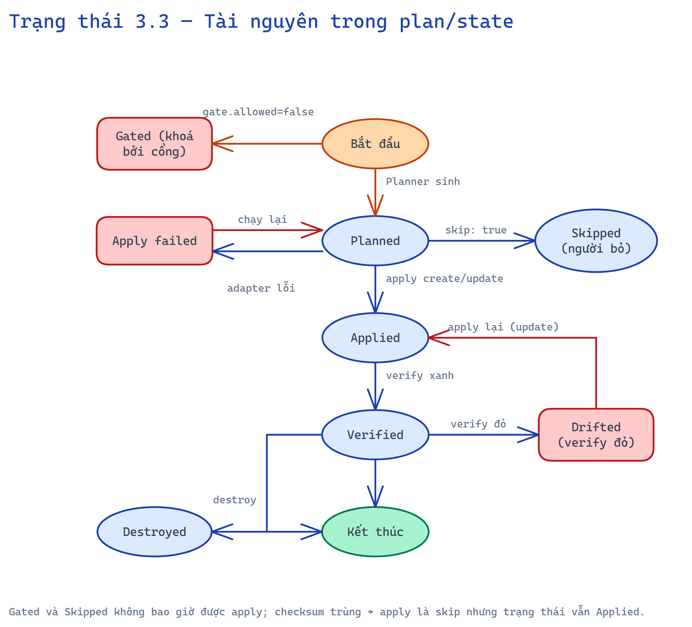
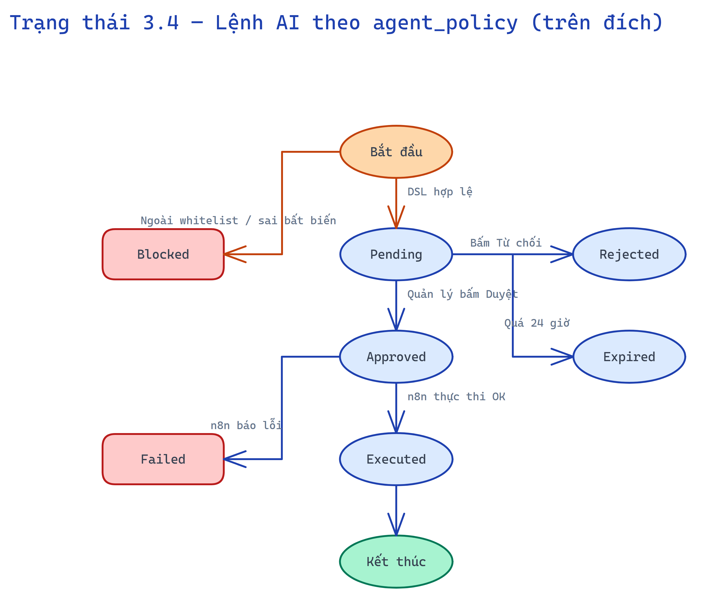
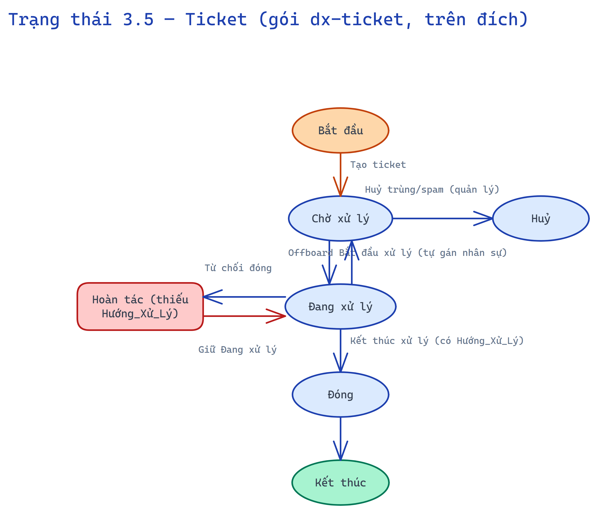

# 3. Biểu đồ trạng thái — DX-Forge

Chỉ vẽ cho đối tượng có ≥ 3 trạng thái. Trục giữa là luồng cơ bản, nhánh bên là luồng thay thế/ngoại lệ.

## 3.1 Đợt đo (Assessment)

*Nguồn chỉnh sửa: [`diagrams/state-01-dot-do.excalidraw`](diagrams/state-01-dot-do.excalidraw)*

## 3.2 Lần chạy (Run) của một giai đoạn

*Nguồn chỉnh sửa: [`diagrams/state-02-lan-chay.excalidraw`](diagrams/state-02-lan-chay.excalidraw)*

## 3.3 Tài nguyên trong plan/state

*Nguồn chỉnh sửa: [`diagrams/state-03-tai-nguyen.excalidraw`](diagrams/state-03-tai-nguyen.excalidraw)*

## 3.4 Lệnh AI theo agent_policy (trên hệ thống sinh ra)

*Nguồn chỉnh sửa: [`diagrams/state-04-lenh-ai.excalidraw`](diagrams/state-04-lenh-ai.excalidraw)*

## 3.5 Ticket (gói dx-ticket, trên hệ thống sinh ra)

*Nguồn chỉnh sửa: [`diagrams/state-02-ticket.excalidraw`](diagrams/state-02-ticket.excalidraw)*

Đối tượng dưới 3 trạng thái, không vẽ: Link khảo sát (active/expired), Intent (draft/valid), Gói ngành (valid/invalid), Phê duyệt plan (pending/approved).
