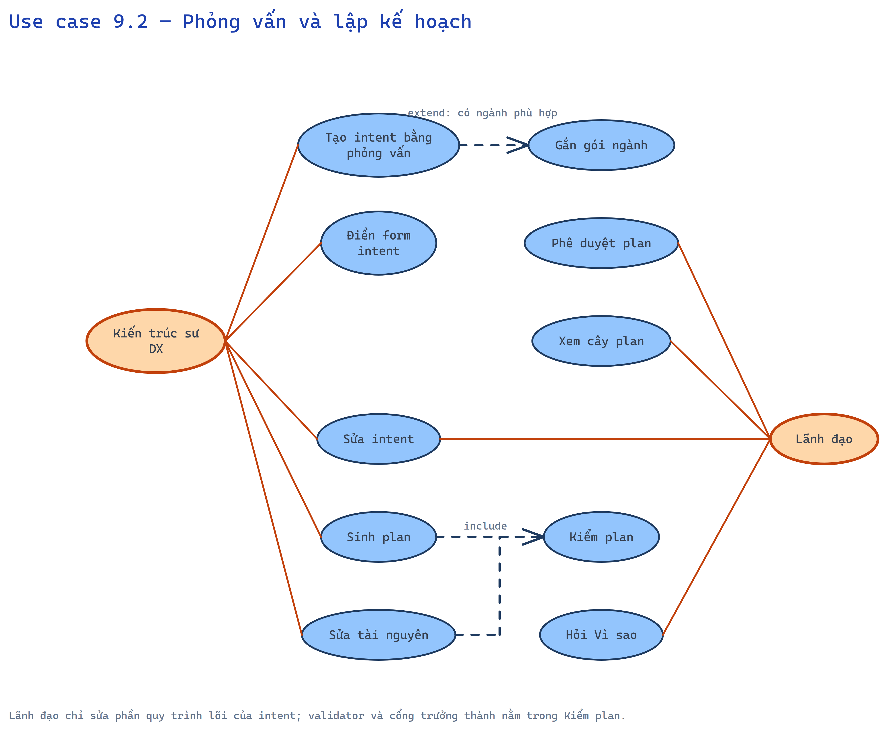
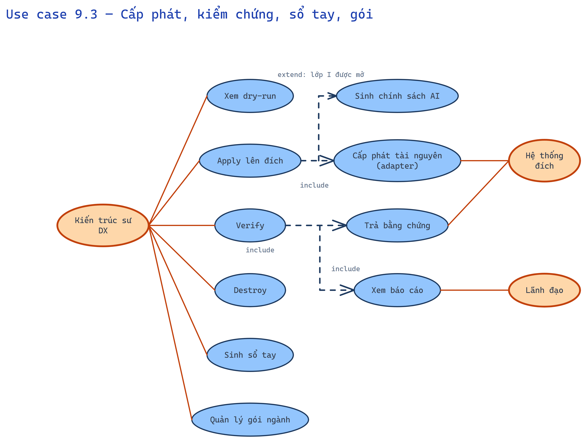

# 9. Sơ đồ use case — DX-Forge

Actor tô cam; use case tô xanh; nét đứt = include / extend; ≤ 10 use case mỗi biểu đồ.

## 9.1 Đo lường và kê đơn (measure)

*Nguồn chỉnh sửa: [`diagrams/usecase-01-do-luong.excalidraw`](diagrams/usecase-01-do-luong.excalidraw)*

## 9.2 Phỏng vấn và lập kế hoạch (interview, plan)

*Nguồn chỉnh sửa: [`diagrams/usecase-02-interview-plan.excalidraw`](diagrams/usecase-02-interview-plan.excalidraw)*

## 9.3 Cấp phát, kiểm chứng, sổ tay, gói (apply, verify, handbook, packs)

*Nguồn chỉnh sửa: [`diagrams/usecase-03-apply-verify.excalidraw`](diagrams/usecase-03-apply-verify.excalidraw)*
