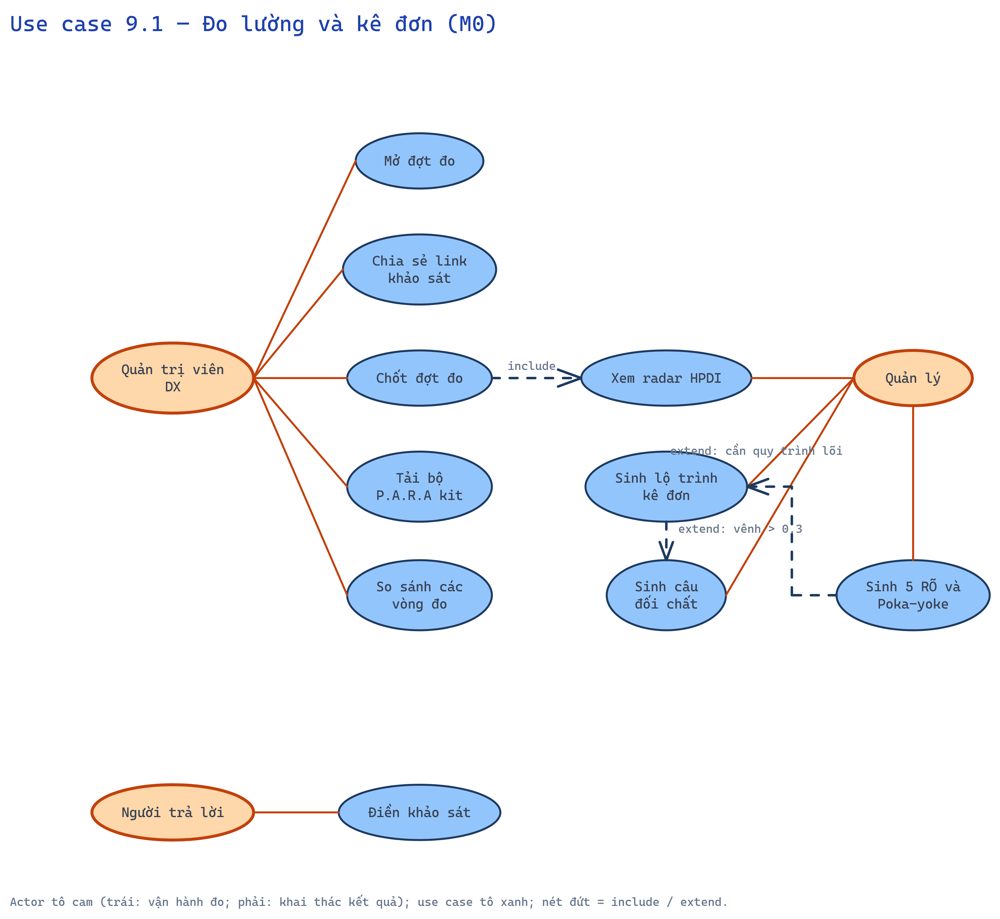
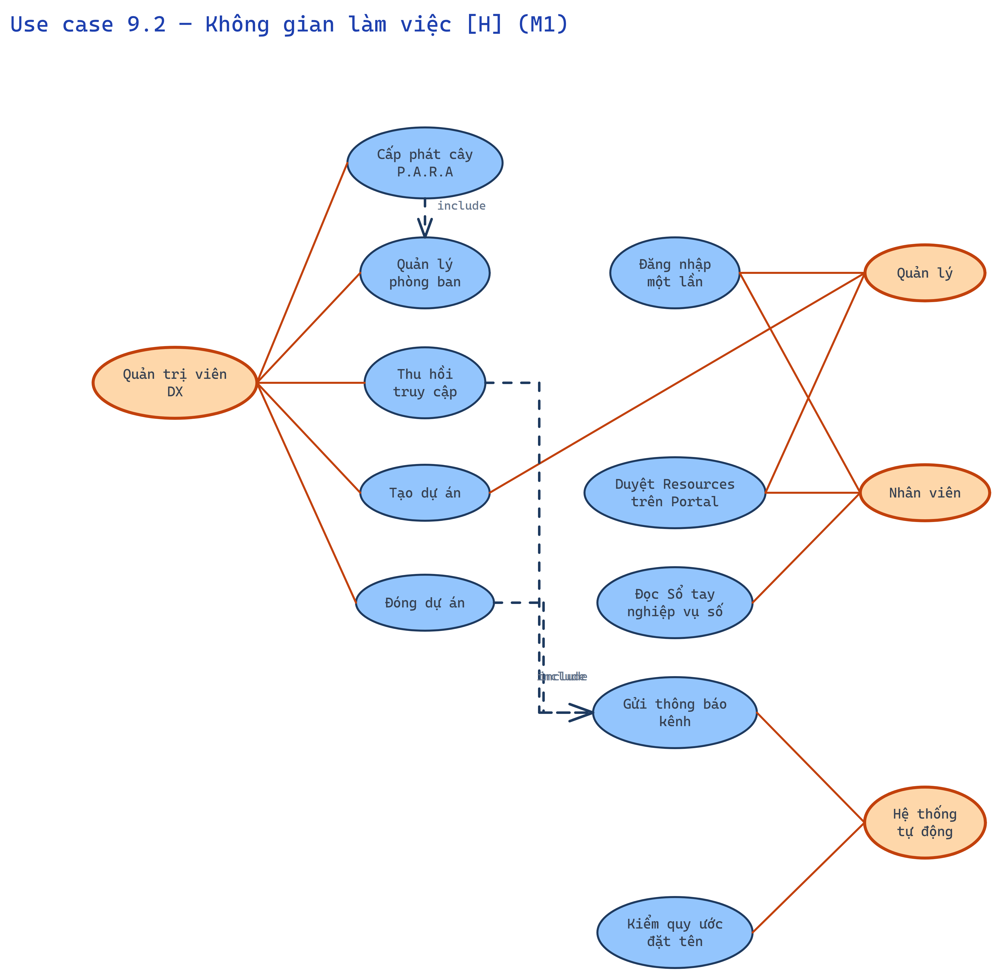
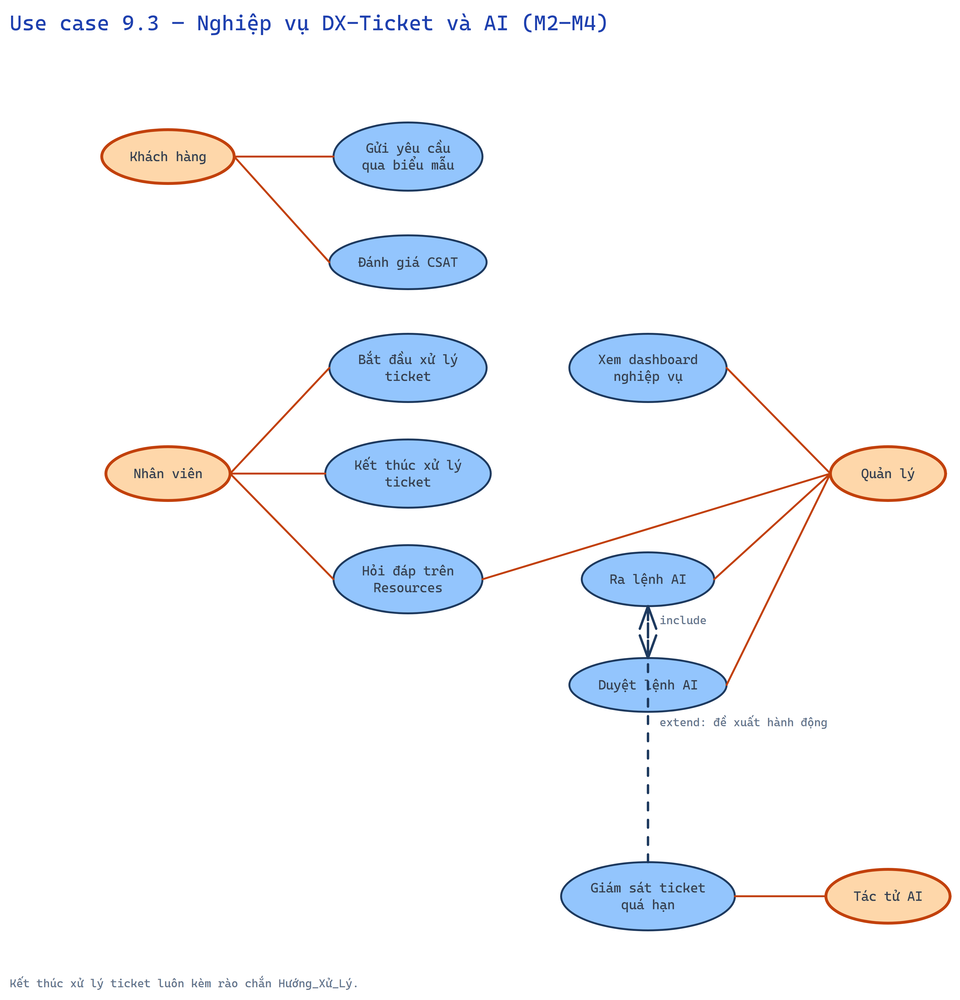

# 9. Sơ đồ use case

Actor tô màu; use case cùng cấp trong một biểu đồ; ≤ 10 use case/biểu đồ. Quan hệ include/extend ghi trên cạnh.

## 9.1 Đo lường và kê đơn (M0)

*Nguồn chỉnh sửa: [`diagrams/usecase-01-do-luong.excalidraw`](diagrams/usecase-01-do-luong.excalidraw)*

## 9.2 Không gian làm việc [H] (M1)

*Nguồn chỉnh sửa: [`diagrams/usecase-02-khong-gian-h.excalidraw`](diagrams/usecase-02-khong-gian-h.excalidraw)*

## 9.3 Nghiệp vụ DX-Ticket và AI (M2, M3, M4)

*Nguồn chỉnh sửa: [`diagrams/usecase-03-ticket-ai.excalidraw`](diagrams/usecase-03-ticket-ai.excalidraw)*
